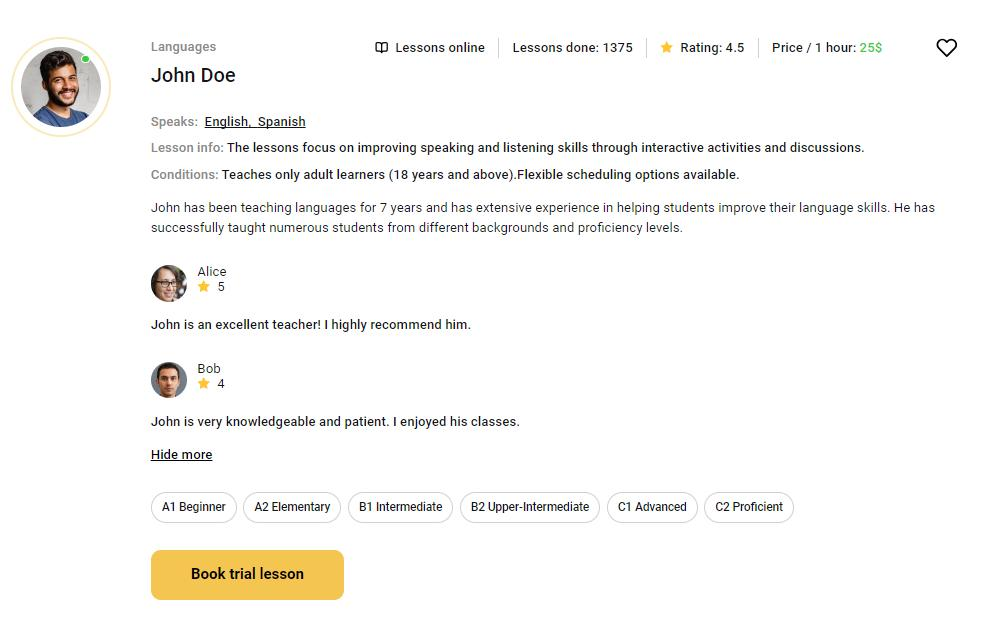

# LearnLingo App


## Overview

This project is a web application consisting of three pages: "Home," "Teachers," and "Favorites." The application showcases the benefits of the company, enables users to add their favorite teachers to a personalized list.

## Technologies Used

- React: The project is built using [Create React App](https://github.com/facebook/create-react-app).For acquaintance
and setting additional features refer to the [documentation](https://facebook.github.io/create-react-app/docs/getting-started).
- [Firebase](https://firebase.google.com/docs/reference): Firebase is used for authentication, real-time database, and data storage.
- [Formik & Yup](https://formik.org/): Formik is employed for form management, and Yup is used for form validation.
- React Router: React Router is utilized for client-side routing within the application.

## Pages

### Home Page

Displays company advantages.
Includes a link to start using the application, redirecting users to the "Teachers" page.
Implements styling with variations in color palettes or a prototype for uniqueness.

### Teachers Page

Renders teacher cards with basic information.
Allows users to load more teacher cards dynamically.
Implements actions such as adding a teacher to favorites, expanding detailed information, and booking a trial lesson.


### Favorites Page

A private page accessible to authenticated users.
Displays teacher cards that the user has added to favorites.
Styled similarly to the "Teachers" page.

## Technical Specifications

### Firebase Authentication:
Implements user registration, login, data retrieval for the current user, and logout.

### Formik & Yup:
Implements registration/login forms with minimal validation.
Modal form closes on clicking the close button, backdrop, or pressing the Esc key.

### Firebase Realtime Database:
Creates a collection of teachers with specified fields using Firebase Realtime Database.
Utilizes a provided JSON file (teachers.json) for populating the collection.

### Teacher Card:
Renders teacher information based on the provided layout.

### Favorites Functionality:
Allows users to add/remove teacher cards to/from their favorites.
Maintains the selected state even after page refresh for authenticated users.

### Read More and Book Trial Lesson:
Expands teacher card details on clicking "Read more."
Opens a modal form for booking a trial lesson on clicking "Book trial lesson."

### React Router:
Implements client-side routing using React Router.

## Getting Started

To get started with this project, follow the installation instructions below.

## Installation

1. Clone the repository to your local computer
```bash
   git clone https://github.com/aniakurtiak/learnLingo
   cd learnLingo-app
   ```
2. Install the dependencies:
   ```bash
   npm install
   ```
3. Start the development server:
   ```bash
   npm start
   ``` 
4. Open
   [https://aniakurtiak.github.io/learnLingo/](https://aniakurtiak.github.io/learnLingo/)
   to view it in the browser.

